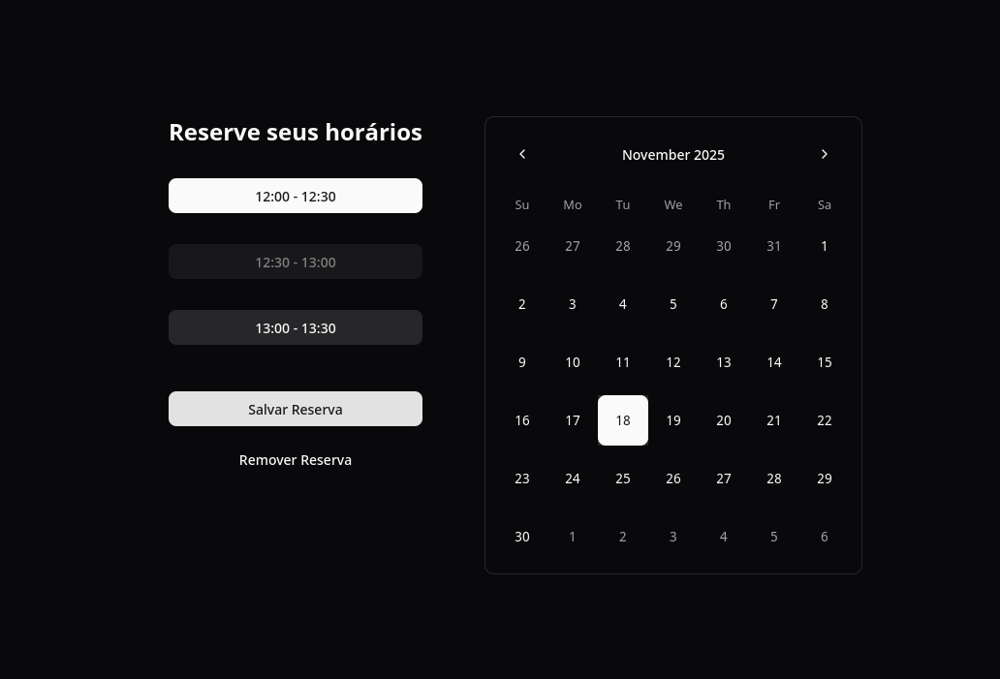
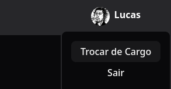
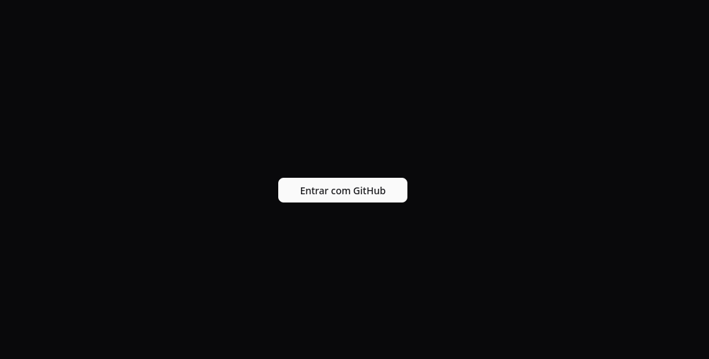
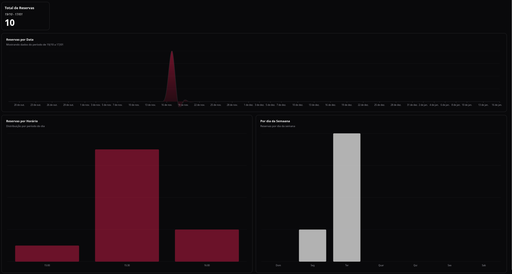

# Tables For Lu

**Tables for Lu** é uma aplicação simples e intuitiva para reservas de mesas.

## Tecnologias

### Convex
O Convex é uma plataforma Backend-as-a-Service que possui sincronização em tempo real e cache já construídos nativamente. Isso significa menos preocupação com o gerenciamento de estado da aplicação e maior foco nas regras de negócio e na implementação das funcionalidades. Como bônus, a interface do usuário se mantém sempre sincronizado com o estado mais atualizado do banco de dados.

Por ser um banco de dados orientado a documentos com validação de esquema, é muito simples iterar sobre o projeto e alterar as estruturas de dados sem a dor de cabeça de migrações complexas. Além disso, como ele infere a tipagem dessas estruturas (e2e type safety), não é necessário reescrever interfaces manualmente entre o back e o front.

O Convex também oferece um serviço de autenticação e autorização integrado. É uma escolha excelente para projetos de menor escala, MVPs e ferramentas internas, pois elimina drasticamente o boilerplate de infraestrutura, permitindo entregar valor muito mais rápido.

### Shadcn/ui + Tailwind CSS
Utilizei a combinação mais popular do ecossistema React moderno. O Tailwind CSS oferece uma abordagem que acelera o desenvolvimento e facilita a manutenção do estilo. Já o shadcn/ui fornece componentes acessíveis, belos, altamente customizáveis e prontos para uso.

### TanStack Start
Uma das melhores maneiras de iniciar um projeto full-stack atualmente. Muitas das bibliotecas TanStack já se tornaram o padrão para React (Router, Query, Form). O TanStack Start unifica essas ferramentas, oferecendo diversas opções de blibliotecas prontos para uso, evitando a necessidade de configurar-las manualmente.

## Arquitetura
O projeto utiliza uma arquitetura modular comum em projetos Full Stack Serverless. O coração da aplicação reside nas pastas `/convex` (backend) e `/src` (frontend).

A proximidade entre o código de back e front-end permite que alterações sejam feitas com grande velocidade, o que foi crucial dado o tempo limitado e o foco no funcionamento correto das regras de negócio.
**Contras:** Esta abordagem foge um pouco da Clean Architecture tradicional, gerando um nível maior de acoplamento no código e potenciais dificuldades de escalabilidade horizontal em cenários mais complexos.

## O que faria com mais tempo?
- **Desacoplamento:** Separar as regras de negócio da aplicação da lógica do Convex, utilizando injeção de dependências para facilitar testes unitários.
- **Autenticação avançada:** Implementar login via OTP (One-Time Password), permitindo acesso via e-mail ou número de telefone por magic link.
- **Melhorias visuais e UX:**
    - Uma tela de Sign-in mais elaborada e acolhedora.
    - Adicionar indicadores visuais no calendário para mostrar dias com reservas existentes e quantidade.
    - Estatísticas de uso e filtros por período na tela de Dashboard.

## O que foi entregue?
- [x] Validação rigorosa das regras de negócio.
- [x] Interface intuitiva e responsiva.
- [x] Tela de cadastro de reserva.
- [x] Tela ou seção de visualização (dashboard gerencial).

## Instruções de execução.
- Instalação de dependencias com `bun i`
- Crie e adicione as chaves ao arquivo `.env.local`
- Rode o comando `bun dev:frontend` e acesse o projeto na rota `localhost:3000`

## Screenshots

 
    
    
     
     

